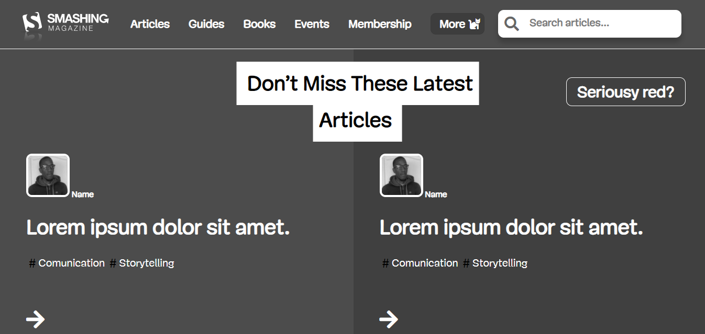

# Smash Magazine Heatmap

> Heatmap for Smash Magazine website



In this project we can see a heatmap of the UI of Smash Magazine

## Built With

- HTML
- CSS

## Live Demo

[Live Demo Link](https://elberthcorniell.github.io/smashing-heatmap/)


## Getting Started

**This is an example of how you may give instructions on setting up your project locally.**
**Modify this file to match your project, remove sections that don't apply. For example: delete the testing section if the currect project doesn't require testing.**


To get a local copy up and running follow these simple example steps.

### Prerequisites

- Live Server plugin for Visual Studio Code 

### Setup

1- Clone the repository
```
git clone https://github.com/elberthcorniell/Youtube-Clone.git
```

2- Open the folder on VS Code, right click the index.html file and click on "Open With Live Server"

3- Everything should be running by now. 


## Authors

👤 **Elbert Corniell**

- GitHub: [@elberthcorniell](https://github.com/elberthcorniell)
- Twitter: [@elberthcorniell](https://twitter.com/elberthcorniell)
- LinkedIn: [LinkedIn](https://www.linkedin.com/in/elbert-corniell-989183159/)


## 🤝 Contributing

Contributions, issues, and feature requests are welcome!

Feel free to check the [issues page](https://github.com/elberthcorniell/smashing-heatmap/issues).

## Show your support

Give a ⭐️ if you like this project!


## 📝 License

This project is [MIT](./LICENSE) licensed.
